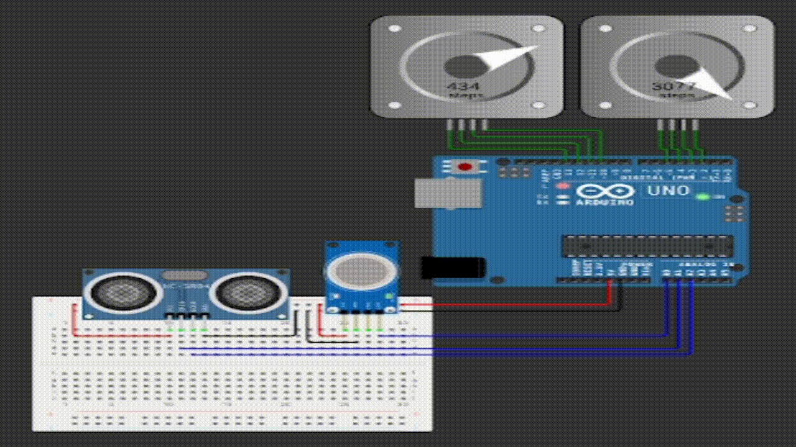
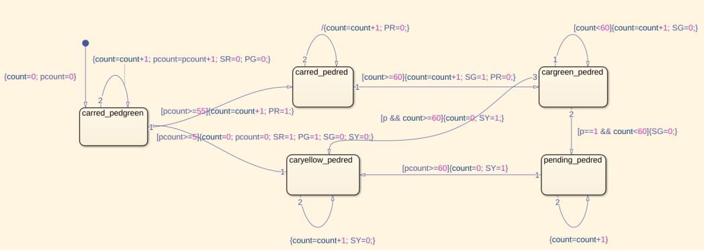
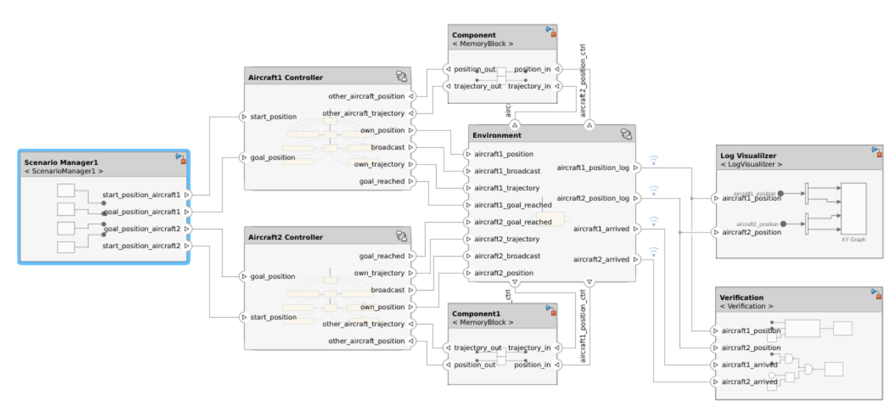
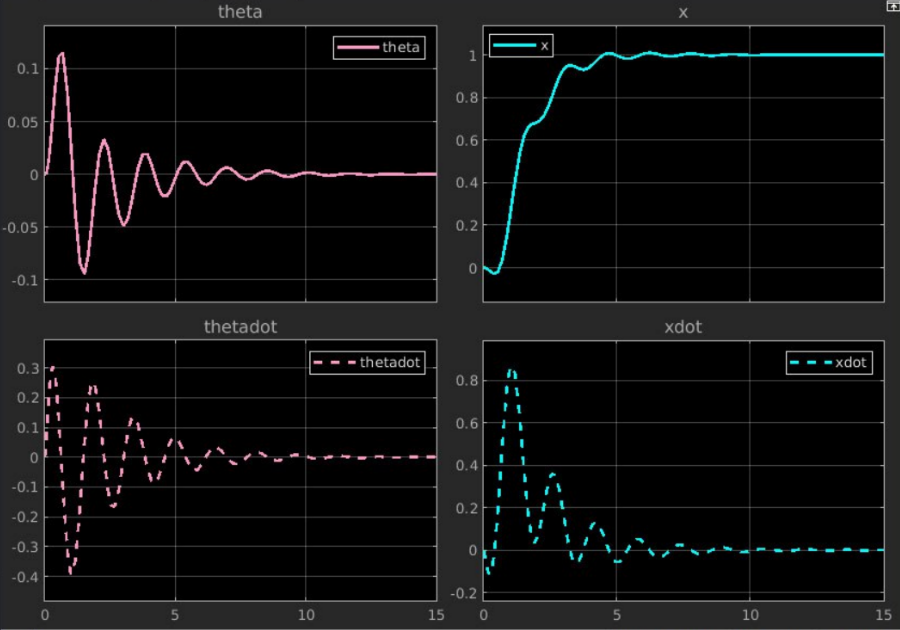

# Model-Based Design and Embedded Systems Project Collection

This repository contains a comprehensive collection of model-based design (MBD) projects and embedded systems implementations using MATLAB/Simulink, C/C++, and various embedded platforms. The projects demonstrate advanced concepts in control systems, real-time systems, embedded programming, and system verification.

<table>
  <tr>
    <td></td>
    <td></td>
  </tr>
  <tr>
    <td></td>
    <td></td>
  </tr>
</table>

## 📁 Project Structure

### [1. Inverted Pendulum Controller](./1.%20Inverted%20Pendulum%20Controller/)
Classical control system implementation for stabilizing an inverted pendulum using MATLAB/Simulink. Includes controller design, system modeling, and equilibrium analysis.

### [2. Traffic Light Robot Model](./2.%20Traffic%20Light%20Robot%20Model/)
Comprehensive traffic light control system with pedestrian and vehicle behavior modeling. Features requirements-based design, Stateflow implementations, and system integration.

### [3. Hierarchical and Composite Models](./3.%20Hierarchical%20and%20Composite%20Models/)
Advanced Simulink modeling techniques including hierarchical subsystems, composite models, and Synchronous Data Flow (SDF) graph implementations in C.

### [4. Embedded Coder Traffic Light](./4.%20Embedded%20Coder%20Traffic%20Light/)
Automatic code generation from Simulink models for embedded targets. Demonstrates the complete workflow from model design to embedded C code implementation.

### [5. Robot Controller Wokwi Simulation](./5.%20Robot%20Controller%20Wokwi%20Simulation/)
Gas detection robot controller with sensor integration, implemented and simulated using Wokwi platform. Features ultrasonic distance sensing and gas detection capabilities.

### [6. FreeRTOS Robot Controller](./6.%20FreeRTOS%20Robot%20Controller/)
Real-time robot controller implementation using FreeRTOS on Arduino platform. Includes task scheduling, semaphore-based synchronization, and multi-sensor integration.

### [7. FIR Filter Optimization](./7.%20FIR%20Filter%20Optimization/)
Comprehensive study of compiler optimization effects on FIR filter implementations. Includes performance analysis across different optimization levels and embedded targets.

### [8. Stateflow Embedded Testing](./8.%20Stateflow%20Embedded%20Testing/)
Stateflow-based embedded system design with comprehensive testing methodologies. Features code coverage analysis and embedded target deployment.

### [Aircraft Collision Avoidance MBD](./Aircraft%20Collision%20Avoidance%20MBD/)
Advanced model-based design project for aircraft collision avoidance systems. Includes requirements management, system architecture, verification, and validation workflows.

## 🛠️ Technologies Used

- **MATLAB/Simulink**: System modeling, simulation, and code generation
- **Stateflow**: State machine modeling and embedded logic design
- **Embedded Coder**: Automatic C/C++ code generation
- **FreeRTOS**: Real-time operating system for embedded applications
- **Arduino**: Embedded hardware platform
- **PlatformIO**: Cross-platform IDE for embedded development
- **Wokwi**: Online electronics simulator
- **Proteus**: Electronic design automation software
- **C/C++**: Low-level embedded programming

## 🎯 Key Features

### Model-Based Design
- Requirements-driven development
- System architecture modeling
- Automatic code generation
- Verification and validation
- Coverage analysis

### Embedded Systems
- Real-time task scheduling
- Sensor integration and data acquisition
- Motor control and actuator management
- Inter-task communication and synchronization
- Performance optimization

### Control Systems
- Classical control theory implementation
- State-space modeling
- Stability analysis
- Controller design and tuning

### Testing and Verification
- Model-in-the-loop (MIL) testing
- Software-in-the-loop (SIL) testing
- Hardware-in-the-loop (HIL) testing
- Code coverage analysis
- Requirements traceability

## 🚀 Getting Started

### Prerequisites
- MATLAB R2020b or later with Simulink
- Embedded Coder Toolbox
- Stateflow Toolbox
- Arduino IDE or PlatformIO
- GCC compiler for embedded targets

### Installation
1. Clone this repository:
   ```bash
   git clone <repository-url>
   cd model-based-design-projects
   ```

2. Open MATLAB and navigate to the project directory

3. For Arduino-based projects, install required libraries:
   - Arduino_FreeRTOS
   - AccelStepper
   - Platform-specific sensor libraries

### Running Projects
Each project directory contains its own README with specific setup and execution instructions. Generally:

1. Navigate to the desired project directory
2. Open the main Simulink model (.slx file)
3. Follow the project-specific README for configuration
4. Run simulations or generate code as needed

## 📊 Project Metrics

- **Total Projects**: 9 major project modules
- **Simulink Models**: 22+ models across all projects
- **Programming Languages**: MATLAB, C, C++
- **Embedded Platforms**: Arduino, generic ARM Cortex-M
- **Real-time Systems**: FreeRTOS implementations
- **Testing Coverage**: Comprehensive test suites with coverage analysis

## 🔧 Development Workflow

1. **Requirements Analysis**: Define system requirements and constraints
2. **System Modeling**: Create Simulink models for system behavior
3. **Simulation**: Validate models through simulation
4. **Code Generation**: Generate embedded C/C++ code
5. **Testing**: Perform comprehensive testing at multiple levels
6. **Deployment**: Deploy to target hardware platforms
7. **Verification**: Validate system performance and requirements compliance

## 📈 Performance Considerations

- Compiler optimization analysis (O0, O1, O2, O3, Os)
- Real-time performance metrics
- Memory usage optimization
- Power consumption analysis
- Execution time profiling

## 🤝 Contributing

This is an educational project collection. For improvements or bug fixes:

1. Fork the repository
2. Create a feature branch
3. Make your changes
4. Test thoroughly
5. Submit a pull request

## 📄 License

This project collection is for educational purposes. Individual components may have different licensing requirements based on the tools and libraries used.

## 📞 Support

For questions or issues related to specific projects, refer to the individual project READMEs or create an issue in the repository.

---

*This project collection demonstrates advanced model-based design principles and embedded systems development practices suitable for academic and professional learning.*
